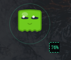
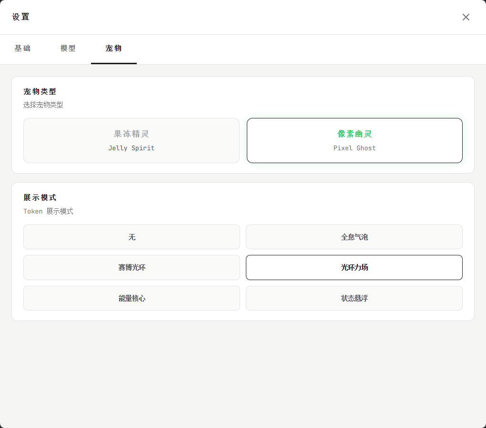
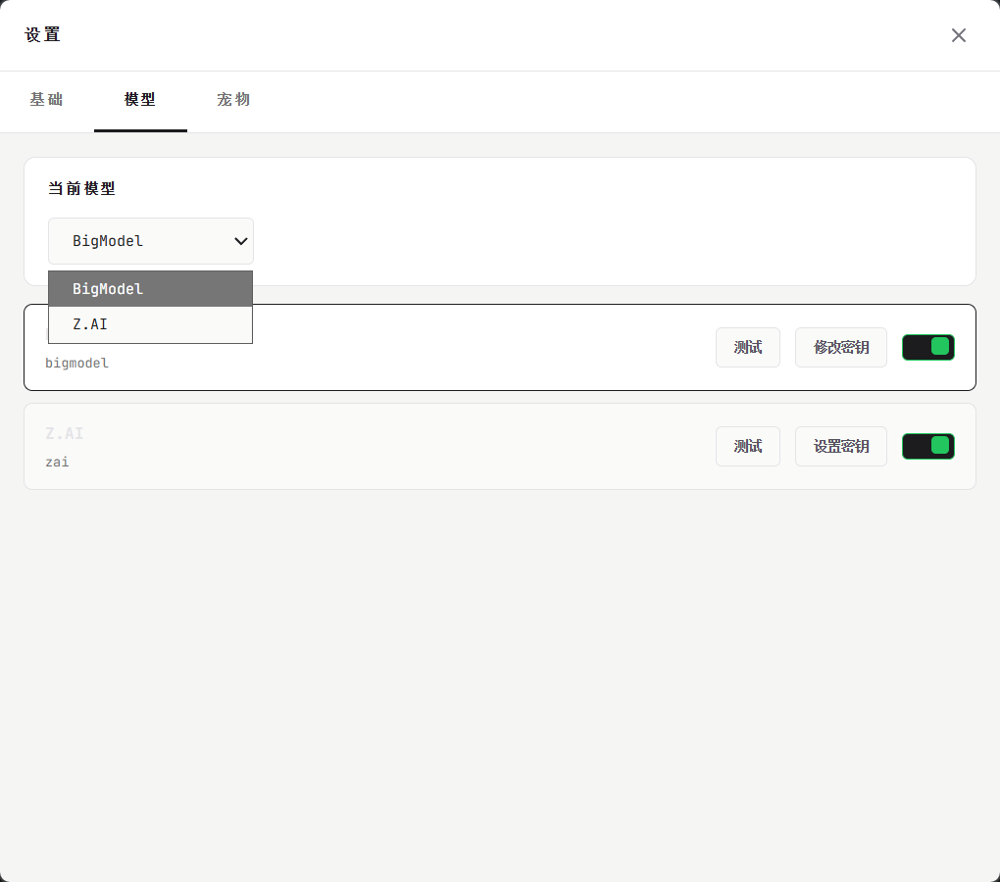

# GLM-Token-Monitor

<div align="center">

**🔍 一个可爱的跨平台桌面 API 配额监控工具**

[](https://github.com/huangbh2020/glm-token-monitor/stargazers)
[](https://github.com/huangbh2020/glm-token-monitor/network/members)
[](https://github.com/huangbh2020/glm-token-monitor/issues)
[](https://opensource.org/licenses/MIT)

[English](./README_EN.md) | 简体中文

</div>

---

## 这是什么？

**GLM-Token-Monitor** 是一个桌面悬浮宠物应用，帮你实时监控 GLM API 的配额使用情况。

如果你经常使用 GLM API（智谱 BigModel 或 Z.AI），可能会遇到这样的问题：
- 忘记查看配额，突然就用完了
- 不知道什么时候重置
- 手动查网页太麻烦

这个小工具就是解决这些问题的 —— 它会以可爱电子宠物的形式，始终悬浮在你的桌面上，让你一眼就能看到当前的配额状态。

## 功能预览

### 桌面宠物



宠物会根据配额使用量自动变换状态：

| 状态 | 使用量 | 表现 |
|:----:|:------:|:-----|
| 🟢 Fresh | 0-30% | 悠闲呼吸，一切正常 |
| 🔵 Flow | 31-60% | 努力工作，敲打动画 |
| 🟡 Warning | 61-80% | 开始紧张，轻微抖动 |
| 🟠 Panic | 81-95% | 非常焦虑，冒汗动画 |
| ⚫ Dead | 96-100% | 配额耗尽，灵魂出窍 |

### 信息气泡

点击宠物查看详细用量：


- **5h Token 额度** - 5 小时窗口内的 Token 使用量
- **MCP 额度** - 月度调用次数限制
- 自动倒计时下次刷新时间

### 设置界面





支持自定义：
- 多种宠物角色（果冻精灵、像素幽灵、狗狗、猫咪等）
- 6 种 Token 显示模式
- 深色/浅色主题
- 开机自启动

## 快速开始

### 安装

**Windows 用户**：
1. 下载 `.exe` 安装包
2. 双击安装
3. 启动后右键托盘图标，选择"设置"

**macOS 用户**：
1. 下载 `.dmg` 文件
2. 拖拽到 Applications
3. 在系统托盘找到应用图标

### 配置 API

首次使用需要配置 API Key：

1. 右键系统托盘图标，选择"设置"
2. 填写你的 API Key
3. 选择提供商（智谱 BigModel 或 Z.AI）
4. 点击"测试连接"验证
5. 保存设置

配置完成后，宠物会自动开始监控配额。

## 使用方式

- **拖动** - 按住宠物拖动到任意位置
- **点击** - 查看详细用量信息
- **右键托盘** - 打开设置或退出应用

## 支持的提供商

- **智谱 BigModel** (open.bigmodel.cn)
- **Z.AI** (api.z.ai)

更多提供商支持中...

## 从源码构建

```bash
# 克隆仓库
git clone https://github.com/huangbh2020/glm-token-monitor.git
cd glm-token-monitor

# 安装依赖
npm install

# 开发模式
npm run tauri:dev

# 构建
npm run tauri:build
```

详细打包指南：[docs/打包指南.md](docs/打包指南.md)

## 技术栈

- **前端**：Vue 3 + TypeScript + TailwindCSS
- **后端**：Rust + Tauri 2.0
- **跨平台**：Windows、macOS、Linux

## 常见问题

### 编译错误

```bash
# 更新 Rust 工具链
rustup update

# 清理缓存重新安装
rm -rf node_modules
npm install
cd src-tauri && cargo clean
```

### API 连接失败

1. 检查 API Key 是否正确
2. 检查网络连接
3. 在设置中点击"测试连接"验证

## 贡献

欢迎提交 Issue 和 Pull Request！

## 许可证

[MIT](LICENSE)

---

<div align="center">

**如果觉得有用，请给个 ⭐️ Star**

Made with ❤️ by [huangbh2020](https://github.com/huangbh2020)

</div>
